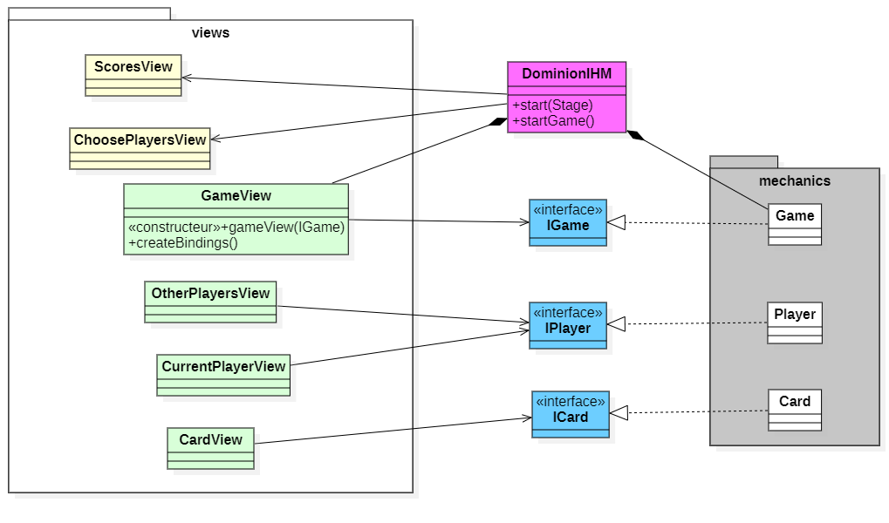

# TP Démarrage du projet _Dominion-Seaside - IHM_

### IUT Montpellier-Sète – Département Informatique

Ce TP est prévu pour vous aider à comprendre comment interagir avec la mécanique interne du jeu. **Attention, ce n'est pas le dépôt correspondant à votre projet**, mais un dépôt correspondant à un travail préparatoire. Chaque membre de l'équipe de projet travaille dans son propre dépôt, afin de se familiariser **individuellement** avec l'environnement. La durée estimative du TP est de **2h-2h30**.

Vous exploiterez ensuite le travail que vous avez fait pendant ce TP, pour l'intégrer (éventuellement en copiant-collant) dans les fichiers de votre projet. Le code de la mécanique de ce TP est totalement identique à celui que vous avez dans le dépôt de votre projet IHM.

Pour vous aider, pensez à consulter le diagramme de classes :

## Étapes (à faire individuellement)
1. On travaille pour l'instant avec la classe `GameView`. Transformez la vue du jeu en `VBox`. 
Ajoutez-y un label `instruction`, et faites en sorte que le texte de ce label corresponde (binding !) à l'instruction donnée par le jeu. 
Choisissez de définir ce composant dans un fichier _fxml_ (à l'endroit où met les fichiers `.fxml` !), plutôt que l'instancier dans la classe `GameView`. 
Définissez aussi, dans un fichier _css_, le style du texte de ce label afin de choisir une fonte de caractères plus grande (18 px par exemple), et pour la suite du TP, vous appliquerez systématiquement ce style au texte des futurs composants graphiques.

   **Remarque** : tous les bindings ou autres attachements de gestionnaires que vous avez créés ou allez créer dans ce TP seront faits dans la méthode `void createBindings()`.
     

2. Ajoutez un attribut `ObjectProperty<? extends IPlayer> currentPlayer` qui référencera le joueur actif du jeu. Ainsi qu'un Label `playerName`. Dans une méthode `bindCurrentPlayer()`, qui sera appelée dans `createBindings()`, vous initialiserez l'attribut `currentPlayer`. 
   Puis vous ferez en sorte que le texte du label `playerName` soit mis à jour lorsque le joueur actif change. Pensez à gérer le cas où ce joueur n'est pas encore défini.
     

3. On va maintenant ajouter le moyen de faire passer le tour. Pour cela, ajoutez un bouton `skip`, et attachez-lui un gestionnaire d'événement `defaultSkipHandler` qui aura comme effet de faire passer le jeu à l'étape suivante (pour l'instant, on doit passer de joueur en joueur). 
Modifiez le fichier _css_ pour que le texte du bouton soit plus grand (18 px par exemple).
     

4. Ajoutez une HBox `handPane`, que vous placerez au dessus du bouton `skip`. Ce composant va refléter les cartes de la main du joueur actif, et pour cela :
  - dans un premier temps, ajoutez une méthode `refreshHand()`, qui, après avoir vidé la liste des enfants de la HBox, la remplit ensuite avec autant de boutons que de cartes dans la main du joueur courant.
  - définissez ensuite un écouteur de changement `currentPlayerChangeListener`, qui s'exécutera à chaque changement du joueur courant, et qui, pour l'instant, mettra en place le composant graphique correspondant à sa main en appelant la méthode appropriée.
  - complétez enfin la méthode `refreshHand` de façon à attacher un gestionnaire d'événement à chaque bouton du `handPane`, dont l'exécution consiste à informer le jeu que cette carte a été choisie. Pour cela, regardez l'interface `IPlayer` et trouvez la méthode qui correspond à ce que vous voulez faire.
      
    Lors de l'exécution, la main est maintenant visible, vous pouvez constater qu'un clic sur un bouton de la main correspondant à une carte TREASURE provoque le changement de l'instruction. Par contre, remarquez que pour l'instant, le composant graphique correspondant à la main n'est pas actualisé.
      

5. Pour préparer l'étape suivante, vous allez commencer par isoler le code qui crée un bouton pour une carte et lui affecte un gestionnaire d'événement, dans une nouvelle fonction `Node createCardNodeInHand(ICard card)`. 
Ecrivez ensuite un écouteur de changement `handListener`, qui mettra à jour le composant graphique `handPane` à chaque changement de sa main (ajout ou suppression de carte). 
Vous ferez attention à attacher cet écouteur à la main du nouveau joueur actif, après l'avoir détaché de la main de l'ancien joueur, à chaque fois que le joueur courant change. 
   **Petit détail technique** : les boutons qui sont ajoutés à `handPane` pourront éventuellement en être supprimés selon les actions du joueur courant. Pour faciliter ce travail, lorsque vous instanciez un bouton (ou autre composant graphique), vous pouvez utiliser la méthode `setUserData(...)` pour lui associer une carte ; par exemple : `cardButton.setUserData(card)`. La méthode `Object getUserData()` (de la classe `Node`) vous permettra ensuite de retrouver le composant graphique associé à une carte, et ainsi de supprimer le bon composant graphique lorsque la carte correspondante est enlevée de la main du joueur.
     

6. On va maintenant transformer la classe `GameView`, de façon à ce qu'elle utilise un composant graphique `CurrentPlayerView`. Pour cela :
  - faites en sorte que la `CurrentPlayerView` soit une VBox, et déplacez-y les composants graphiques `playerName` et `handPane`, ainsi que l'attribut `currentPlayer`.
  - ajoutez, dans `GameView`, un attribut `currentPlayerPane` de classe `CurrentPlayerView`.
  - déplacez aussi l'écouteur de changement `currentPlayerChangeListener`, les méthodes `bindJoueurActif()`, et `refreshHand()`, et invoquez-les correctement dans la classe `GameView`.
      

7. Travaillez de même que pour la main pour faire apparaitre la liste des cartes en jeu (`inPlayPane` à ajouter à la `CurrentPlayerView`). Notez que les boutons qui correspondent aux cartes en jeu ne réagiront pas à des événements, donc ne leur attachez pas de gestionnaire d'événement ; vous pouvez pour cela écrire une méthode `Node createNodeInPlay(ICard card)` inspirée de la précédente méthode.
     

### Étapes suivantes (à faire éventuellement en équipe) :
- ajoutez les cartes `supplyPile` dans la vue du jeu.
- ajoutez, toujours dans la vue du jeu, le panneau des autres joueurs, qui sera un composant en soi.

